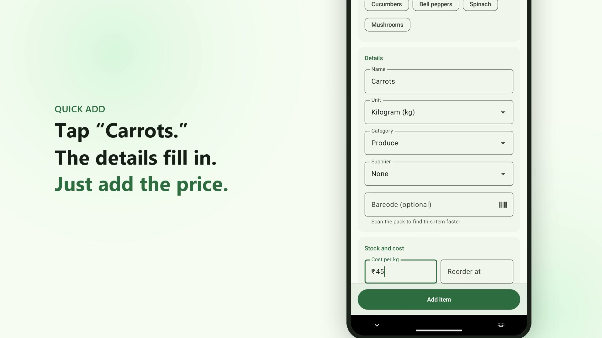

# Kitchen Inventory

[](docs/demo.mp4)

*20-second demo. Click the image to watch.*

A lightweight Android app for tracking restaurant stock. Everything is stored on the phone in a
local SQLite (Room) database: no server, no account.

- Minimum Android 11 (API 30), target API 35
- Kotlin, Jetpack Compose (Material 3), Room, Navigation Compose
- No DI framework or network libraries, to keep the APK small. Barcode scanning uses Google Play
  services' code scanner, so the app needs no camera permission

## What's in it so far

- **Items**: name, unit, category, supplier, cost per unit, reorder level, order-up-to level,
  barcode, notes. Add, edit, and
  remove (removed items are archived so their history stays available for reports).
- **Item list**: search by item or supplier, filter by category or low stock, and a summary of
  item count, low-stock count and total stock value.
- **Suppliers**: add, edit and delete vendors with phone, email and notes.
- **Stock movements**: on-hand quantity is the sum of an item's movements (opening stock, stock
  in, usage, waste, adjustments), so every change is traceable.
- **Record**: log deliveries (stock in), kitchen usage or waste for many items in one go, with an
  optional note and date. Shows what stock will be after, warns when usage is more than you have,
  and offers Undo right after saving.
- **Quick count**: type what is on the shelf at the end of the day; the app corrects stock to match
  with count adjustments and shows how much each item was over or short.
- **Low-stock alerts**: after a save, a popup lists items that just dropped to their reorder
  level, and the Stock tab shows a badge with the number of low items.
- **History**: every stock change grouped by day, filterable by type and searchable. Tap an entry
  to see details or delete a mistake.
- **Barcode scanning**: scan a pack on the Stock tab to open its item (or add it if it's new), or
  in the Record and Count search boxes to jump straight to it. Typing a barcode in a search works too.
- **Purchase orders**: low-stock items grouped by supplier, with amounts that refill each item to
  its order-up-to level (or twice its reorder level). Adjust amounts, send the order through any
  app (email, SMS, WhatsApp...), call the supplier, and mark it received to add it to stock.
- **Reports**: for the last 7 or 30 days, this month, last month, or any dates you pick: value received, used, wasted
  and lost or found in counts, waste percentage, most used and most wasted items, usage by
  category, and current stock value by category.
- **Tablets**: on wide screens the tabs move to a side rail, the Stock tab shows the item list and
  the open item side by side, and other screens keep a comfortable reading width.
- Common units (kg, g, L, case, ...) and categories (Produce, Dairy & Eggs, ...) are pre-filled.

## Building

Open the folder in Android Studio, or run:

```
./gradlew assembleDebug
```

The APK lands in `app/build/outputs/apk/debug/`. Unit tests: `./gradlew testDebugUnitTest`.

## Code layout

```
app/src/main/java/com/kitcheninventory/
  data/db/     Room entities, DAOs, database and seed data
  data/repo/   InventoryRepository, the single data entry point for screens
  ui/items/    Item list and add/edit screens, form validation
  ui/stock/    Record (stock in, usage, waste) and quick count screens, entry logic
  ui/history/  Stock change history
  ui/orders/   Purchase orders by supplier
  ui/reports/  Reports screen and report calculations
  ui/suppliers Supplier list and edit dialog
  ui/common/   Shared widgets, icons, barcode scanner, formatting, ViewModel factory
  ui/theme/    Material 3 theme
```
